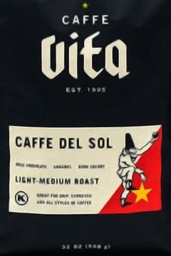
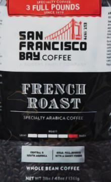

# Notes: Costco Coffee Beans

## General Advice

I'm not an expert, but some common opinions:

* Freshness matters a lot.
* Grind your own beans--it takes only a moment.
* When the vendor says "blend" it really means "random, whatever's cheapest".
* It's generally better if they give source details.
* "Dark roast" is over-rated, but vendors like it because consistent.

## Provisos

This document is meant to boost my own memory, but might be helpful
to somebody else.  No guarantee we would agree on taste.

I don't like dark roast coffee, so not exploring that territory much.

## Sorted List

In order of best to worst.

---------------------------------------------------------------------------

### Organic Mt Comfort Peru Coffee Whole Bean

* Unfortunately no longer available at costco.
* Available on Amazon but pricy.
* Works well hot and cold.
* Taste: "chocolatey, nutty."

---------------------------------------------------------------------------

### Kirkland Signature Organic Mexico Oaxaca Medium Roast

* Flavor is more centered than Caffe Vita.
* It's a bit expensive.
* Taste: "caramel, chocolate, roasted peanuts."

---------------------------------------------------------------------------

### Caffe Vita Coffee Caffe Del Sol Blend Whole Bean, Medium Roast

* It has a pretty strong taste, like some kind of root, better hot than cold.
* Caffe Vita is apparently a coffee roaster based in Seattle.
* "mix of Ethiopia, Indonesia, and South American coffees."
* Taste: "milk chocolate caramel and dark cherry."

---------------------------------------------------------------------------

### San Francisco Bay French Roast

* Dark roast--very much so.
* It was on sale. Never again.
* If you have to use it, use it for cold brew.
* Taste: "full bodied with a smokey finish"... actually like ashes.
