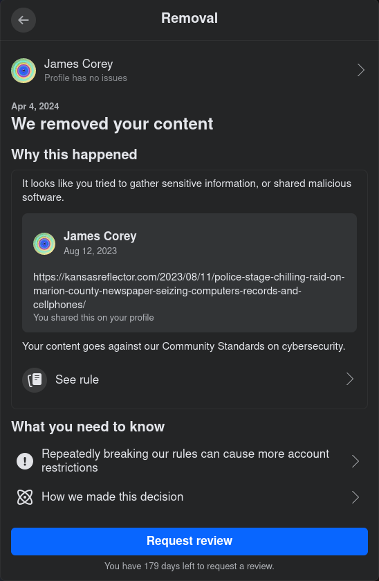

# Exiting from Facebook

Written April 4 2024.

----------------------------------------------------------------------------

## TL;DR

Henceforth find me at:

* Mastodon ([@jaymcor@mastodon.acm.org](https://mastodon.acm.org/@jaymcor)) for public messages
* Matrix.org ([@jaymcor:matrix.org](https://matrix.to/#/@jaymcor:matrix.org)) for private messages

How to get set up quickly on those:

* [my mastodon quickstart guide](mastodon_quickstart.html)
* [matrix.org start page](https://matrix.org)

----------------------------------------------------------------------------

## Irony

The day before I wrote this, **I was just defending Facebook**.  There had been
some disinformation which claimed they had banned a thing they clearly had not
banned, and would likely never ban.  I pointed out that the disinformation had
already been addressed by snopes and other sites, and should never have been
taken seriously without credible evidence.  I provided references for clarity.

Absurdly, the disinformation itself was being distributed via Facebook,
including a copy of the thing that was purported to be banned.  Everything
about it was dumb, that's probably the best summary.

Note, not a complete vindication of Facebook, just that they were
blameless on that specific occasion.

----------------------------------------------------------------------------

## General Malaise

I've often complained in the past about Facebook's product quality issues
around UX, reliability and trustworthiness, but I tend to just put up with it.

The fact that you can't control what might appear in your feed or in what
order means that you can never be sure you've seen what your friends wrote,
or whether a thing in your feed is from who it purports to be from, or avoid
seeing disinformation, incendiary content, or just ads that the AI chooses to
mix in.  So their basic premise requires the **complete erosion of trust**.

There's no point in me rehashing all my complaints here, especially since I
evidently was willing to put up with it.

Like many, I complain, but am a creature of habit, too lazy to change, and not
wanting to abandon the network of friends who are also using the platform.  The
vendor lock-in problem is naturally the ultimate cause of the anti-competitive
landscape that has led to these annoying quality issues.  At times I'm less
active, at times I take take a hiatus, but I generally return.

From time to time, friends have told me about **strange administrative actions**
taken against them, and I've paid attention but tried not to over-react.  It's
concerning, but I like to think of myself as patient and open-minded...

----------------------------------------------------------------------------

## Something I Care About

On August 11 2023, some corrupt small town officials in Marion county Kansas
engaged in a punitive raid of a local newspaper, resulting in the death of the
98-year-old co-owner, Joan Meyer.

I think of it as a morality litmus test.  If it doesn't bother you,
then your psyche needs some TLC.  We all do.  I'm happy to chat about it.

The particular incident was reported widely.  I posted a link, to one of
the articles on the subject, on August 12 2023.

On April 4 2024, I received the following notice from Facebook, stating that
my post on the subject had been removed, and claiming I had violated their
community standards:

If there had been a gray issue, I would perhaps have checked myself and
been thankful for the feedback.  It wasn't.

I double-checked that the newspaper article I linked was still valid, did not
seem to contain any surprises, and that no major news had changed the nature of
the dialogue in any way that could warrant such a takedown.

I don't think it violates community standards.  The problem does not seem to be
with my post.  Rather, this is perhaps the most egregious form of corporate
censorship--not even born of dogmatic policy or confused hysteria, but
of abject mediocrity.

It may well be that there is some person or small business specializing in
social media manipulation and/or reputation repair, trying to remove
references to news of that particular incident, possibly on behalf of the
very same perpetrators.  But that should not be allowed, as it confirms their idea
that they can use unscrupulous means to get away with whatever they desire.  Yet
it seems this sort of practice is business as usual.

Ultimately it does not matter how exactly it is happening.  I don't mean to say
that any person employed by Meta Platforms, Inc is deliberately abetting these
crimes.  Nor should the failings of one set of individuals condemn the entire
company.  However, I believe that, **by leaving their automated moderation
systems in a broken, inaccurate, and easily misused state, Facebook is, at the
very least, indirectly abetting fraudsters and manipulators**--through
negligence and incompetence.

And now that it has been brought so directly to my attention, it seems to me that I
should not support that.  I believe my **recourse is to take my business elsewhere**.
I won't miss the ads or deliberate blurring of authentic and inauthentic content.

----------------------------------------------------------------------------

## Update

* [A local news site was critical of Facebook—then Meta banned all their links](https://www.thehandbasket.co/p/facebook-kansas-reflector-links-banned)

I now have a more detailed understanding of what is going on.  I
am not in fact placated by this.

----------------------------------------------------------------------------

## More Information About Joan Meyer

For anyone wanting more information about the news event I linked to:

* [Police stage ‘chilling’ raid on Marion County newspaper, seizing computers, records and cellphones](https://kansasreflector.com/2023/08/11/police-stage-chilling-raid-on-marion-county-newspaper-seizing-computers-records-and-cellphones/)
* [Colorado authorities wrapping up investigation into Marion police who raided Kansas newspaper](https://kansasreflector.com/2024/04/02/colorado-authorities-wrapping-up-investigation-into-marion-police-who-raided-kansas-newspaper/)
* [‘Duty to democracy’: Kansas newspaper files lawsuit after police raided the newsroom](https://www.kansascity.com/news/state/kansas/article287270750.html)
* [Raiding the newspaper wasn’t Marion’s first attack on democracy and the 1st Amendment](https://www.kansas.com/opinion/guest-commentary/article287290395.html)
* [Kansas Newspaper publisher sues over police raid, claiming retaliation](https://www.washingtonpost.com/nation/2024/04/03/kansas-newspaper-raid-lawsuit/)

----------------------------------------------------------------------------

## Going Forward

I will stop using Facebook until the situation improves.

I will emphasize free, open, and distributed systems such as the fediverse.

I don't want to just jump from one corporate walled garden to another.
Although I may have friends who feel attached to WeChat, WhatsApp, etc, I want
to avoid going down the same road with other proprietary solutions that don't
prioritize the interests of users.

Goals in prioritized order:

* platform itself is known to be trustworthy
* cryptographic securing of identity
* good performance and not too buggy
* available on both web browser and phone app
* easy enough for non-technical users
* good moderation, transparent administration
* respect user's time and subscription preferences
* no lock-in, ideally
* free--no way I'm going to force someone else to pay $
* UI not too bad
* the more flexible the better

What I considered:

* Mastodon (Ruby; popular)
* Matrix.org / Element (Rust,Kotlin,React,etc; well known)
* Diaspora (Ruby; makes you send email requesting an invite, then says $8)
* WriteFreely / Write.as (Go; costs for hosted version)
* Plume (Rust; unmaintained)
* Misskey (Typescript; unstable--misskey.ai gone, weird interface, hard to recommend)
* Friendica (PHP; slow, sad interface, have to fill in a form and wait for approval)

### Public Discussions

Additional public forum goals:

* public posts viewable by public without creating any kind of account
* ideally can delete and/or block any or all comments on my own posts
* bad actors deplatformed quickly, encounters rare

I'll **continue using my existing Mastodon account**
([@jaymcor@mastodon.acm.org](https://mastodon.acm.org/@jaymcor))
for public discussion, sharing, reposting, and such, with a little less worry
about over-posting.  But I will lean on boosting, so that if somebody is only
marginally interested in following, they can just mute the boosts.

Since Mastodon is typically limited to short and simple posts, for long posts
or reference material of permanent interest, I will use something separate.
While I am comfortable writing markdown and generating HTML pages (at
jaymcor.github.io), I would prefer to use something that I can recommend for
non-technical users, such as Diaspora.  However, since I can not find a good
recommendation, I'll just do my long-format posts the old-fashioned way for now
and link them from Mastodon.

See [my quickstart guide](mastodon_quickstart.html) for help with Mastodon.

### Private Conversations with Friends and Close Friends

Additional private chatroom goals:

* encrypted by default
* quick and easy to create account
* group ownership and/or asymmetric trust
* implicit "acquaintances" group?
* choose group feed or merged feed (so by default I need not click each group)

For private communication it will be crucial for the other party to have a
trusted identity, and presumably cryptographic keys.

In my opinion, it is generally a mistake to try to remember that a seemingly
private conversation is less private than it looks.  Humans are bad at
detecting tiny security errors that can have big consequences.  So in a
platform that seeks to support private conversations, it is better to be
encrypted by default.

It seems like **matrix.org is the main open encrypted option available**
currently, and has been building out the technology fairly well.  A lot
of their design decisions seem to have been made exactly the way I would
make them (presumably a good thing).

My address there is [@jaymcor:matrix.org](https://matrix.to/#/@jaymcor:matrix.org).

For (at most) a couple dozen close friends whom I trust strongly, have met in
real life, have known for many years, whose identity I have verified, and with
whom I am willing to share more detailed information about my private life, I
will maintain a group of closest friends.  Less public updates will go to there.
Any important public updates about myself, sent to the public Mastodon
group, will also be mirrored here.

Usability test: the matrix.org system was comfortable and easy to get stuff
done, passed all my basic testing, so I think I can recommend that to other
people.

See [matrix.org](https://matrix.org) for creating new accounts--it's pretty
easy, probably no need for me to write any special instructions for that.
