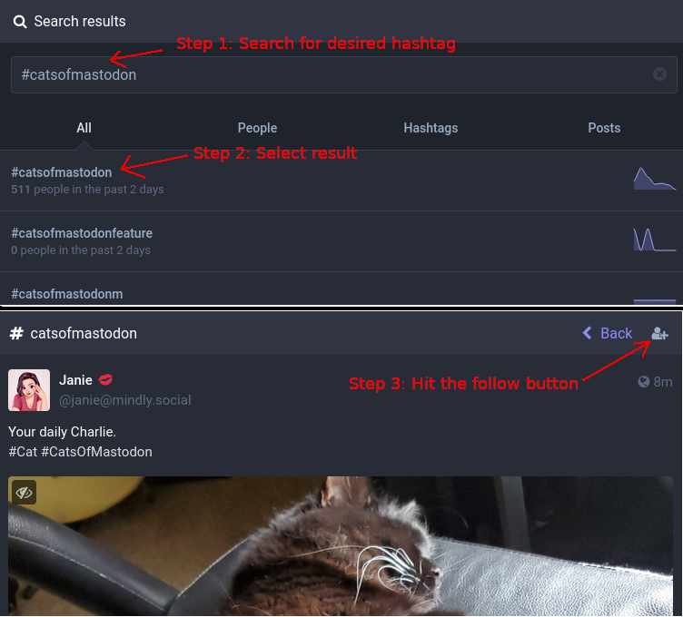

# More Mastadon Tips & Trivia

----------------------------------------------------------------------------

## Narrow mode

If you have your monitor vertically oriented, it seems to automatically
switch into a "mobile" style layout where the left column is dropped.
Looks much better in my opinion.

### What about searching?

But where did the search box go?

You don't need it, you can click on *Explore* on the right column and search
from there.

----------------------------------------------------------------------------

## Following a hashtag

Be aware that some of the popular hashtags can have quite a few posts, and
it might be more than you'd want to wade through on a daily basis.  That said,
you just need to search for the hashtag (e.g. under the Explore window),
select the hashtag to view it, and then click the little + box in the upper
right hand corner.



Not every phone app knows how to follow hashtags.  Tusky supports it.  At time
of writing, the official Mastodon app didn't seem to support it.  However it
works with the Mastodon PWA (see below for instructions).

----------------------------------------------------------------------------

## Mobile apps

### Any phone

There's a PWA, so you get an experience similar to the browser one.
It's pretty good on mobile devices, definitely worth installing.  You
can have it installed simultaneously with whatever other app.

Just use your phone's web browser to open your server's home page (in my case
https://mas.to/home) like you would on the desktop, then tell it to install the
PWA on the phone, which will provide yet another "app" icon for accessing
Mastodon on your phone.

### Android

There are a bunch of options, here's what I've tried:

* The Official Mastadon App
* Tusky

I'm currently using Tusky because I'm happy that the developer pissed off the
fascists by being so eager to quelch them on his app at the drop of the hat, so
now they seem to be angrily pushing FUD against Tusky.  If the fascists are
unhappy, that's a sign of doing something right.

### Iphone

There are a bunch, haven't tried them.

* MetaText is apparently quite popular

----------------------------------------------------------------------------

## Verified Links

### Why

Because accounts can be easily impersonated.

### Embedded Link

Under your preferences/profile, link to some well known sites that people
independently know as you.  If that site has an appropriate link leading back
to your Mastodon profile, then the link will be highlighted in green and given
a checkmark.

In theory, it's as simple as embedding the following code in an external
link that you control:

```
<a rel="me" href="https://mas.to/@jaymcor">Mastodon</a>
```

However, sometimes you don't have access to raw HTML, or it gets modified
by the system you're linking to.

#### LinkedIn

I have not yet found a way to make it work.

DM me at `@jaymcor@mas.to` if you figure out how.

#### Facebook

I have not yet found a way to make it work.

Surprisingly frustrating, navigating the labyrinth hoping for a way to just
update my profile to show a simple external contact URL.  DM me at
`@jaymcor@mas.to` if you figure out how.

#### GitHub

Mostly github wants to remove the `rel="me"` part, but there is a way.

Create a user repo, e.g. `jaymcor.github.io` and add your own raw `index.html`...

### Fediverse

It just works, linking to other fediverse accounts.

----------------------------------------------------------------------------

## Moving from one server to another

### Why

* new server is more fitting
* old server has a problem
* to taste the freedom

### What happens?

You move most of your data including past posts, the list of things
you follow, local filters, bookmarks, etc.

**You get to choose** whether followers of your old address will automatically
be switched to point at your new address (in most cases you should do it).

### How

There's a process, it has to be done in a particular order.

* On old server, export your data
  * Note that your "Archive" includes:
    * your liked posts
    * your own posts
    * your media (e.g. images you posted)
  * You'll want to separately download the CSV for follows, blocks, mutes, etc
  * Your bookmarks are available as separate CSV but also included in archive
    * Best to grab the CSV as well just for good measure
* On new server, create the new account
  * Make the new account profile page look the way you want now
  * Pretend you're a counterfeiter--duplicate the following
    * profile avatar pic
    * profile header pic
    * bio
    * verified links
  * Basic preferences e.g. "slow mode", themes, etc
  * Don't try to duplicate your followers, that will be done below
* On new server, goto Prefs/Account/MovingFrom and set old address as alias to new
* Consider posting your intro on the new server now
  * This way, it goes out on the new server before your old followers migrate
  * Users on the new server: may be interested
  * Users that already followed: won't need to see it again
* The next step officially migrates you, snatching your followers to the new server
  * Your old account will be mostly disabled
  * If you want to grab any other info from it, do it now
  * If you want to catch up reading or anything else, do it now
  * See note at end of this section
* On old server, goto Prefs/Account/MovingTo, put new address, old password
  * It is done, you are migrated
* On new server, restore data as needed
  * all those CSV files--bookmarks, follows, blocks, mutes, etc

Check [the official docs](https://docs.joinmastodon.org/user/moving/) for an authoritative guide.

See also [Josh Justice's guide](https://codingitwrong.com/2022/10/10/migrating-a-mastodon-account.html) for some details.

**Note: at time of writing (2022-12-26) you still need to manually recreate the details in your profile, e.g. profile pic, bio, etc.  When you start the `MovingTo` process, the old account will be dimmed/disabled and will refer people to the new one, so best to finish exporting data, copying profile, and anything else you need with the old account, before you begin the `MovingTo` step.**
